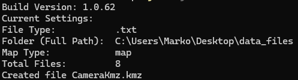
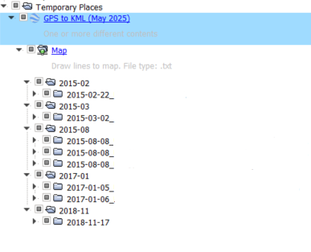
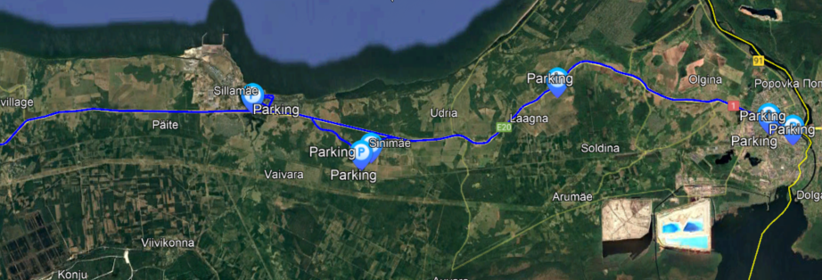
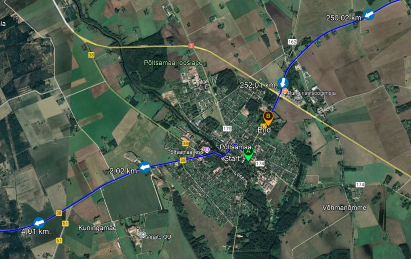

# GPS to KML 2025 (Summer)

Rakendus on [GPStoKML4](https://github.com/OkramL/GPStoKML4) nullist uus arendus GPS logide 
KML faili paigutamine päevade kaupa.

# Logide tüübid

Siia on toodud erinevad logid mis on toetatud. Mõned on standardsed mõned aga [ExifTool](https://exiftool.org/)
väljavõte või mõne rakenduse eksport.

## Failitüüp .txt
Fail on originaalis kaamera [Mini 0803](https://www.google.com/search?q=Mini+0803) (vana) ja 
kaamera [Mini 0805](https://www.amacam.net/car-cameras/am-m81/) (uus). Uue kaamera GPS salvestatud andmed faili on 
vigased, sest ei salvestta õigesti. Kui kasutada ExifTooli, saab õiged andmed videofaili lugedes.

Vana txt (Mini 0803) faili sisu:
```A,030116,164432.000,+5836.7477,N,+02430.5115,E,0.29,-00.61,-07.96,-78.40;```

Uus txt (Mini 0805) faili sisu:
```A,160523,134158.000,5900.5654,N,2447.7115,E,13,+00.00,+00.00,+00.00;```

## Failitüüp .csv
Antud failitüüp on rakenduse [CanWay](https://canway.software.informer.com/) eksport tulemus. Rakendus on vajalik kahele 
järgnevale GPS seadmele.
Vanem [Canmore GT-750F(L)](https://canadagps.ca/products/canmore-gt-750fl-bluetooth-usb-dual-interfaces-gps-receiver-data-logger-sirf-4-low-power-consumption-gps-chipsetset-waas-a-gps-250k-waypoints-bluetooth-v2-0-connects-up-to-10-meters)
ja uuem [Renkforce GT-730FL-S](https://www.conrad.com/en/p/gps-logger-renkforce-gt-730fl-s-black-373686.html?srsltid=AfmBOopvpY2oMGGUS4OyublOUwh1Vsuz7fH-iENl_a1F0dcvahKfzegs)

Faili csv sisu:
```335,2025/06/12,12:59:08.00,2025/06/12,15:59:08.00,58.925146,N,24.868836,E,76.3,0.0```

## Failitüüp .0805, .hero8 ja .canyon
Antud failitüübid pole standardsed. Need on loodud rakenduse ExifTool abil mis loeb videofailidest GPS andmeid ja 
kirjutab need logifaili.

Failitüüp .0805 on kaamera Mini 0805 videofaili lugemise tulemusena saadud fail. 

Failitüüp .hero8 on [GoPro Hero 8](https://gopro.com/en/us/update/hero8-black) videofaili lugemise tulemusena saadud 
fail.

Failitüüp .canyon on autokaamera [Canyon DVR40GPS](https://canyon.eu/product/cnd-dvr40gps/) videofaili lugemise 
tulemusena saadud fail.

Teoorias võiks olla need kõik ühe failitüübiga, kuid kuna mul on kõik seadmed eraldi, siis on ka erinev laiend aga sama 
sisu. Laias laastus on ühe struktuuriga:

**.0805**   ```2022:08:28 15:15:11Z,58.6129433333333,24.5088286666667,1```

**.hero8**  ```2022:07:20 17:08:26.355,58.6129315,24.5089832,2.708```

**.canyon** ```2025:06:16 05:51:07Z,58.6308512369792,24.5016153971354,90.4146394348145```

## Failitüüp .gpx
See failitüüp on nutikella [Xiaomi Mi Smart Band 6](https://www.mi.com/global/product/mi-smart-band-6/) ja vanema 
versiooni mobiilirakenduse [Zepp Life](https://play.google.com/store/apps/details?id=com.xiaomi.hm.health) GPS track 
eksport. 
```
<?xml version='1.0' encoding='UTF-8' standalone='yes' ?>
<gpx xsi:schemaLocation="http://www.topografix.com/GPX/1/1 http://www.topografix.com/GPX/1/1/gpx.xsd" xmlns="http://www.topografix.com/GPX/1/1" xmlns:xsi="http://www.w3.org/2001/XMLSchema-instance" xmlns:ns3="http://www.garmin.com/xmlschemas/TrackPointExtension/v1" xmlns:ns2="http://www.garmin.com/xmlschemas/GpxExtensions/v3" xmlns:ns1="http://www.cluetrust.com/XML/GPXDATA/1/0" creator="ZeppLife App" version="6.8.1">
    <trk>
        <name><![CDATA[20231013 Outdoor cycling]]></name>
        <trkseg>
            <trkpt lat="58.612736" lon="24.508934">
                <time>2023-10-13T13:10:57Z</time>
                <desc><![CDATA[CommonTimeValuePoint(absoluteTime=1697202657, value=1.8)]]></desc>
                <extensions>
                    <ns3:TrackPointExtension>
                    <ns3:speed>0.5555556</ns3:speed>
                    </ns3:TrackPointExtension>
                </extensions>
            </trkpt>
            <trkpt ...>
                ...
            </trkpt>
        </trkseg>
    </trk>
</gpx>	
```

## Failitüüp .kml
Tegemist on [Sinotrack ST-903](https://www.google.com/search?q=Sinotrack+ST-903) GPS mooduliga, millel SIM kaart ja 
kasutusel autos. Tarkvaraks on kasutusel tasuline [Ruhavik](https://ruhavik.com/en) online jälgimine. 

kml faili üldine struktuur on järgmine
```
<?xml version="1.0" encoding="UTF-8"?>
<kml xmlns="http://www.opengis.net/kml/2.2" xmlns:gx="http://www.google.com/kml/ext/2.2" xmlns:kml="http://www.opengis.net/kml/2.2" xmlns:atom="http://www.w3.org/2005/Atom">
<Document>
  <name>Track 2025-06-11</name>
  <LineStyle>
    <color>7f00ffff</color>
    <width>7</width>
  </LineStyle>
  <PolyStyle>
    <color>7f00ff00</color>
  </PolyStyle>
  <Placemark>
    <description>Your track</description>
    <styleUrl>#yellowLineGreenPoly</styleUrl>
    <LineString>
        <extrude>1</extrude>
        <tessellate>1</tessellate>
        <altitudeMode>absolute</altitudeMode>
        <coordinates>
          24.509172,58.613107
          24.509157,58.613113
          ...
        </coordinates>  
      </LineString>
</Placemark>
</Document>
</kml>
```

# Ekraanipildid


data_files sisaldab logi faile. Antud juhul .txt. Luuakse ainult kaart (map) mitte kiiruse kaart (speed). 
Tulemus on CameraKmz.kmz failis. Kokku oli 8 faili mida töödeldi.



Allkriipsuga lõppevad kuupäevad sisaldavad seal kuupäeva kirjeldust (_description_) ehk sõidu marsruuti, eraldatud kohad  
sidekriipsuga.



Vaikimis näeb kohe sõidus olnud parkimisi, kui neid on, kuid seal on ka algus ja lõpu ikoonid.



Sõidu algus ja lõpp ning sõidu suund on ka näidatud. Klikkides ikoon saab lisa infot. Seda ei näe speed kaardil (1.0.62).

# Esmane kasutus (enne loe, ja siis tee)

1. Lae alla First Public Release [GPStoKML_2025_Summer-1.0.63.jar](https://github.com/OkramL/GPStoKML_2025_Summer/releases/tag/1.0.63)
2. Tee uus kaust ja kopeeri/tõsta allalaetud fail tehtud kausta
3. Ava käsurida või Powerhsell Terminal samas kaustas
4. Kirjuta käsureale käsklus ```java -jar GPStoKML_2025_Summer-1.0.63.jar``` või ```java -jar .\GPStoKML_2025_Summer-1.0.63.jar```
5. Järgnevalt näed midagi järgmist: 
```
Build Version: 1.0.63
No settings file (settings.ini) found. Using default settings.
Sample settings file settings.ini has been created.
Folder does not exist: data_files. Interrupting...
```
6. Selle tulemusena loodi siia samasse ```settings.ini``` fail. Ava see fail ja vaata sisu üle. Seaded on dokumenteeritud.
7. Järgnevaks tee olemasolevasse kausta alamkaust ```data_files```, juhul kui seda seadetes ```default_folder=data_files``` pole muutnud.
8. Nüüd kopeeri vajalikud logifailid kausta ```data_files```. **NB!** Failinimed peavad algama kuupäevaga kujul **AAAA-KK-PP**
9. Käivita rakendus uuesti nagu punktis 4. Kui midagi valesti ei läinud, peaks nägema midagi sellist:
```
Build Version: 1.0.63
Current Settings:
File Type:           .txt
Folder (Full Path):  C:\Users\Marko\Desktop\GpsToKml_2025_Summer\data_files
Map Type:            map
Total Files:         8
Created file CameraKmz.kmz
```

# Logifailide nimed

Selleks, et kogu rakendus toimiks on eeldatud et failid mida töödeldakse algaks kuupäevaga. See võib sisaldada 
selgitust ja kirjeldus. Failinimi ei tohi sisaldada tühikuid. Kuupäev on kujul AAAA-KK-PP, AASTA-KUU-PÄEV

Failinime süntaks: ```date_explanation_description-description-description```
Näide: ```2025-01-31_broken_Pärnu-Tallinn-Tartu-Narva```

Failinime süntaks: ```date_explanation_```
Näide: ```2025-02-28_unknown_```

Failinime süntaks: ```date_description-description```
Näide: ```2025-05-31_Tallinn``` või ```2025-06-01_Pärnu-Haapsalu```

